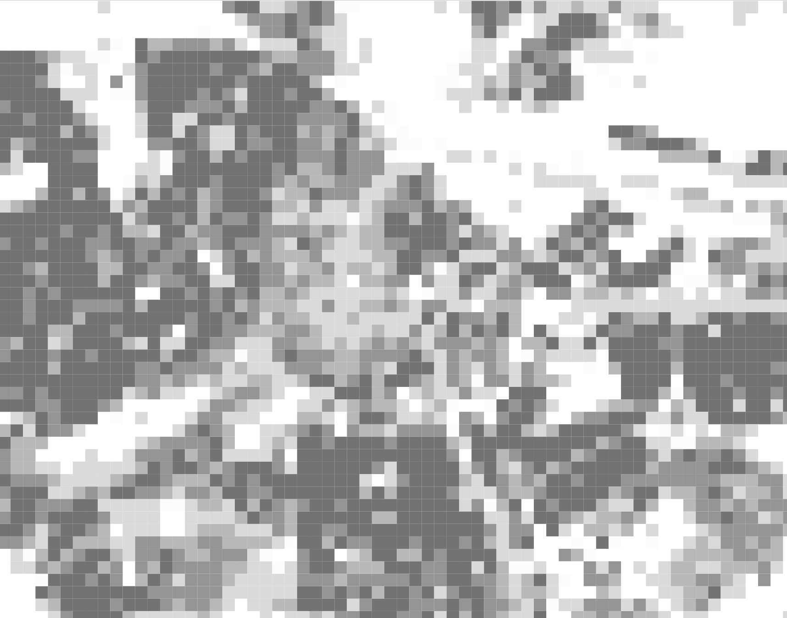

::: {#illustration layout-ncol=2}

{}

{}

:::

### Description

Cities are intrinsically diverse and heterogeneous. However, where diverse people reside can lead to local concentrations of homogeneous populations. This spatial separation of social groups is known as residential segregation. In segregated cities, it is therefore common to find differentiated zones. When such zones are adjacent, the discontinuity created is called a social frontiers [@Piekut2019segregation]. The behaviours on both sides of the frontier can vary [@olner2024conflicting], making it an interesting geographical discontinuity. According to [@dean2019frontiers], these “cliff edges in the complex landscape of segregation” are not so easy to identify robustly. Most current methods involve Bayesian spatial models.

For this project, we propose to make use of CBS fine grained data available at grid level (100x100m) to treat the spatial distribution of social attributes (income, wealth, household composition, age, migration background for instance) as raster data, and to apply image processing techniques (edge detection, shifting, rescaling) to identify social frontiers and compare them across social attributes, across scales and across cities in the Netherlands.

In short, this project will contribute a valuable method for advancing research in urban geography by importing imagery techniques into the study of residential segregation.

### Contact
Clémentine Cottineau-Mugadza and Daniele Cannatella

### References

::: {#refs}
:::

------------------------------------------------------------------------

This project would be part of the ERC project [{fig-align="left" width="80"}](http://erc-segue.nl/) on urban economic segregation
